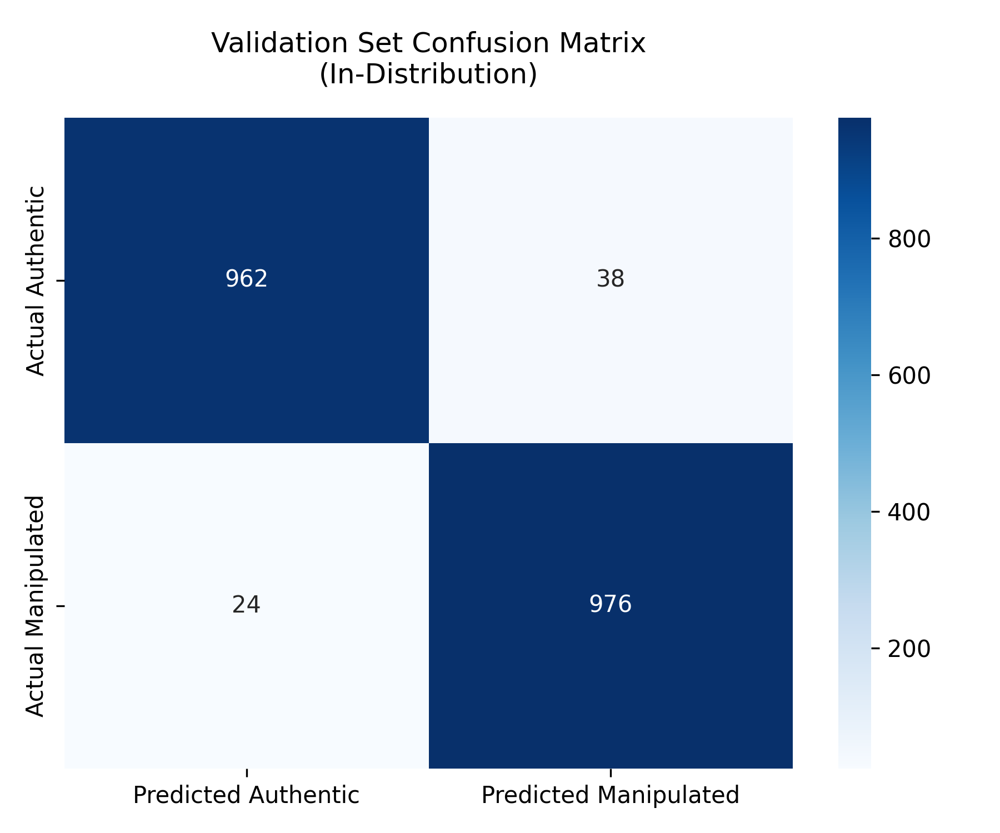
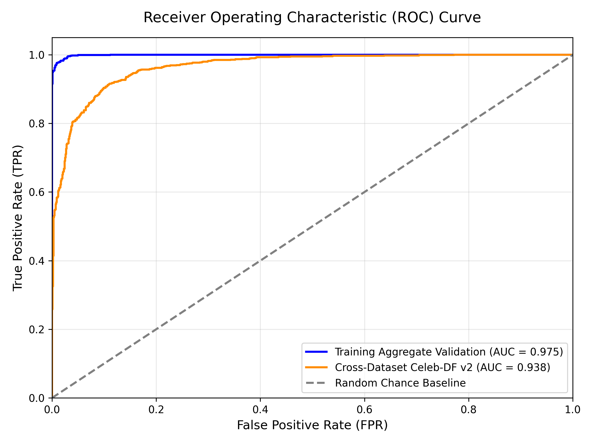

# Silent Trails: Profiling Human Patterns Across the Digitalverse

> **Final Year Project** — A full-stack OSINT and Digital Forensics Intelligence Platform that combines Open-Source Intelligence (OSINT) gathering, credential breach analysis, deepfake detection, and behavioural pattern analysis.

## Overview

Silent Trails is a forensic intelligence platform designed to help investigators profile a digital subject by aggregating data from multiple intelligence sources. The system is composed of three major modules:

| Module | Description |
|--------|-------------|
| **Digital Recon (OSINT)** | SpiderFoot-powered deep scanning of domains, IPs, URLs, and email breach lookups via LeakCheck |
| **Deepfake Forensics** | Dual-engine deepfake detection using DINOv2 Three-Stream architecture + InceptionResnetV1 |
| **Investigation Timeline** | Persistent case management — save scan results to a structured investigation timeline |

## System Architecture

```
.───────────────────────────────────────────────────.
|                  React Frontend (Vite)              |
|         Digital Recon | Deepfake | Timeline         |
.──────────────────────.──────────────────────────────.
                       | REST API
.──────────────────────v──────────────────────────────.
|              Node.js Backend (:5000)                 |
|   SpiderFoot Proxy | LeakCheck | VirusTotal | Auth   |
.──────.──────────────────────────────.────────────────.
       | Docker                       | HTTP
.──────v───────.           .──────────v──────────────.
|  SpiderFoot  |           | Python Inference (:8001) |
|  Container   |           |  DINOv2 + InceptionV1    |
|   (:5001)    |           |  FastAPI + PyTorch        |
.──────────────.           .──────────────────────────.
                                        |
                                .───────v──────.
                                |   Supabase   |
                                |  (Auth + DB) |
                                .──────────────.
```

## Deepfake Detection Model

### Dual-Engine Fusion Architecture

The forensics engine uses a **MAX-fusion** of two complementary detectors:

**Engine 1: InceptionResnetV1 (Face Swap Detector)**
- Pre-trained on VGGFace2, fine-tuned for manipulation detection
- Targets classical face-swap and GAN artifacts

**Engine 2: DINOv2 Three-Stream (AI Generation Detector)**
- **Spatial Stream**: DINOv2-Base + LoRA adapters, outputs 512-dim embedding
- **Frequency Stream**: FFT log-magnitude spectrum through a 4-layer CNN, outputs 512-dim
- **Attention Stream**: Cross-attention region queries (eyes/mouth/jaw/hair), outputs 512-dim + spatial heatmap
- **Adaptive Fusion**: Quality-aware weighted combination of all three streams

```
Final Score = MAX(Engine1_Score, Engine2_Score)
```

Either engine can trigger a detection, catching both face swaps **and** AI-generated content.

### Training Datasets

The model was trained across three datasets to maximize generalization:

| Dataset | Description |
|---------|-------------|
| **FaceForensics++** | Large-scale benchmark with 4 manipulation types (Deepfakes, Face2Face, FaceSwap, NeuralTextures) |
| **HIDF** | High-quality identity-diverse deepfake dataset |
| **DeepDetect 2025** | Latest generation synthetic media including diffusion-model outputs |

### Model Performance

| Metric | Value |
|--------|-------|
| Val AUC | **0.9999** |
| Val Accuracy | **99.7%** |
| Precision | **99.6%** |
| Recall | **99.8%** |

### Forensic Visualisations

- **Attention Heatmap**: Overlays where the model detected manipulation on the face
- **FFT Frequency Map**: Shows anomalous GAN/diffusion artifact spikes in the frequency domain

| Confusion Matrix | ROC Curve |
|:---:|:---:|
|  |  |

## Tech Stack

### Frontend
- **React 18** + **Vite**
- Vanilla CSS (dark mode, glassmorphism)
- React Router

### Backend (Node.js)
- **Express.js**
- SpiderFoot Docker proxy
- LeakCheck Public API (email breach lookup)
- VirusTotal + URLhaus (URL/IP threat intel)
- Supabase (PostgreSQL + Auth)

### Python Inference Server
- **FastAPI** + **Uvicorn**
- **PyTorch** + **DINOv2**
- **facenet-pytorch** (MTCNN + InceptionResnetV1)
- **OpenCV** + **Pillow** (visualisation)

### Infrastructure
- **Docker**: SpiderFoot OSINT engine
- **Supabase**: authentication and database
- **Google Colab Pro**: model training

## Getting Started

### Prerequisites

- Node.js 18+
- Python 3.10+
- Docker Desktop
- A Supabase project

### 1. Clone the Repository

```bash
git clone https://github.com/rzfaheem/Silent-Trails-Profiling-Human-Patterns-Across-the-Digitalverse.git
cd Silent-Trails-Profiling-Human-Patterns-Across-the-Digitalverse
```

### 2. Configure Environment Variables

Create a `.env` file in the project root:

```env
# Supabase
VITE_SUPABASE_URL=your_supabase_url
VITE_SUPABASE_ANON_KEY=your_supabase_anon_key

# Backend (in backend/.env or inline)
SUPABASE_URL=your_supabase_url
SUPABASE_SERVICE_KEY=your_supabase_service_key
VIRUSTOTAL_API_KEY=your_virustotal_key
SPIDERFOOT_URL=http://localhost:5001
INFERENCE_SERVER=http://127.0.0.1:8001
```

### 3. Install Frontend Dependencies

```bash
npm install
```

### 4. Install Backend Dependencies

```bash
cd backend
npm install
```

### 5. Start SpiderFoot (Docker)

```bash
docker run -p 5001:5001 smicallef/spiderfoot
```

### 6. Start the Node.js Backend

```bash
cd backend
node server.js
```

### 7. Start the Python Inference Server

```bash
pip install -r deepfake_model/requirements.txt
cd deepfake_model
python -m src.inference.server
```

> **Note:** The inference server requires a trained checkpoint (`.pth` file).
> Place it at: `deepfake_model/checkpoints/best_model.pth`
> The `resnetinceptionv1_epoch_32.pth` for Engine 1 must also be placed in `deepfake_model/`.

### 8. Start the Frontend

```bash
npm run dev
```

Open [http://localhost:5173](http://localhost:5173)

## Project Structure

```
Silent-Trails/
├── src/                          # React frontend
│   ├── pages/                    # Route-level pages
│   │   ├── SocialMapping.jsx     # OSINT / Digital Recon module
│   │   ├── DeepfakeForensics.jsx # Deepfake detection module
│   │   ├── Timeline.jsx          # Investigation timeline
│   │   └── Dashboard.jsx
│   ├── components/               # Reusable UI components
│   └── styles/                   # CSS stylesheets
│
├── backend/
│   └── server.js                 # Node.js Express API server
│
├── deepfake_model/
│   ├── src/
│   │   ├── models/               # DINOv2 three-stream model
│   │   │   ├── deepfake_model.py
│   │   │   ├── spatial_stream.py
│   │   │   ├── frequency_stream.py
│   │   │   ├── attention_stream.py
│   │   │   └── adaptive_fusion.py
│   │   ├── inference/
│   │   │   └── server.py         # FastAPI inference server
│   │   ├── training/             # Loss functions, metrics, trainer
│   │   └── data/                 # Dataset and augmentation pipeline
│   ├── notebooks/                # Google Colab training notebooks
│   ├── configs/                  # Training hyperparameters (YAML)
│   ├── train.py                  # Main training entry point
│   └── requirements.txt
│
├── supabase_schema.sql           # Database schema
├── package.json
└── vite.config.js
```

## Academic Context

This project was developed as a **Final Year Project (FYP)** at the undergraduate level.

### Research Contributions
1. **Multi-stream fusion** for deepfake detection combining spatial, frequency, and attention-based analysis
2. **MAX-fusion dual-engine** combining face-swap detection with AI-generation detection for broader coverage
3. **Forensic visualisations** (FFT maps, attention heatmaps) providing explainability for each prediction
4. **Integrated OSINT platform** combining SpiderFoot, breach lookups, and phishing analysis in a unified UI

### Limitations
- Social media image compression (WhatsApp/Telegram) strips EXIF metadata and degrades frequency artifacts, reducing detection reliability for re-shared media
- Training on multiple datasets improves generalization, but performance may vary on unseen diffusion-model outputs not represented in training

## License

This project is for **academic and educational purposes only**.
All third-party APIs and tools are used under their respective licences.

## Author

**Faheem Raza**
Final Year CS Student
GitHub: [@rzfaheem](https://github.com/rzfaheem)
